5分钟快速入门
======

这个平台是干嘛的？
------

这是一个容器和服务的运行平台，你可以
1. 基于任意已有的 docker 镜像启动容器（IaaS：基础设施即服务模式）
1. 从服务市场里挑选任意服务一键启动（PaaS：平台即服务模式）

我为什么要用这个平台？
------

1. 工作需要想长期启动一些服务，还没有服务器？那就把你的容器运行到这里。
1. 除了解决资源问题，平台还能通过内置的动态调度机制保证你的容器的高可用，再也不用担心服务器宕机影响开发了。
1. 服务市场提供了很多常用的服务，例如 MySQL，Kafka，Spark，一键安装启动。

启动你的第一个容器
------

1. 登录用户控制台：console.paas.k2
1. 在弹框中输入你的用户名，点击"LOGIN"登录（注：平台通过用户名对容器可见性进行隔离，不用担心别人看到和乱操作你的服务。团队内部可以协调一个用户名来管理共享服务）
1. 在左侧导航栏点击“Services”
1. 点击右上角的“+”（Run a Service）
1. 选择Single Container
1. Service 配置如下图，Network选择Virtual Network，设置Health Check，然后点击REVIEW & RUN，应用就会启动了。

Service 设置

	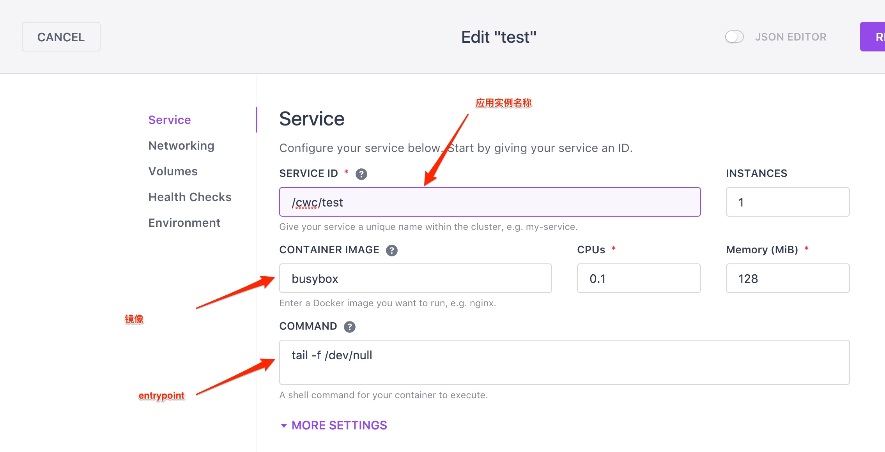

网络设置

	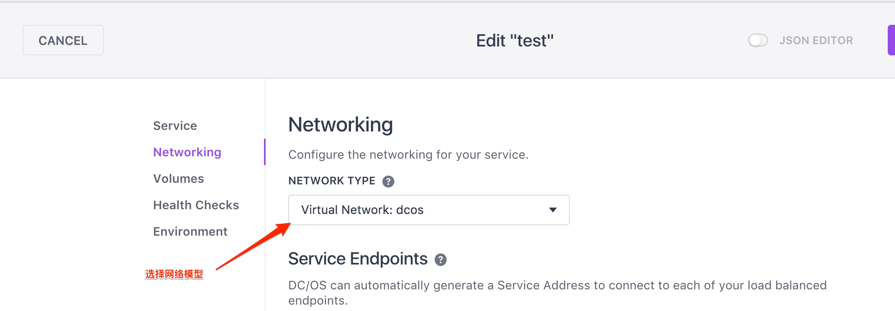

Health Check设置

	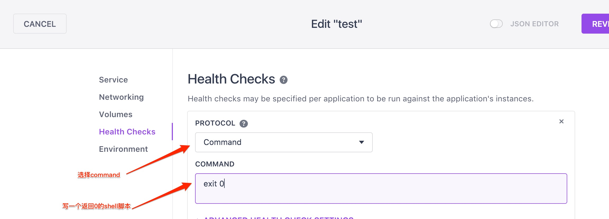

一个更实际，稍微复杂一点的应用配置：Nginx
------
操作步骤：点击右上角的“+”（Run a Service），选择Single Container。Service 配置如下图,

	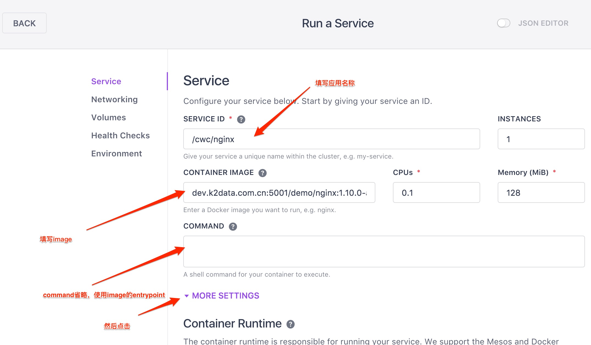

因为我们要使用私有镜像库dev.k2data.com.cn:5001，所以要把该镜像库的证书信息以 artifact 的方式传递给该应用。
当然我们已经提前把证书打包好了，具体操作如下：点击MORE SETTINGS，点击"+ Artifact"，输入file:///etc/docker.tar.gz（固定写法）

	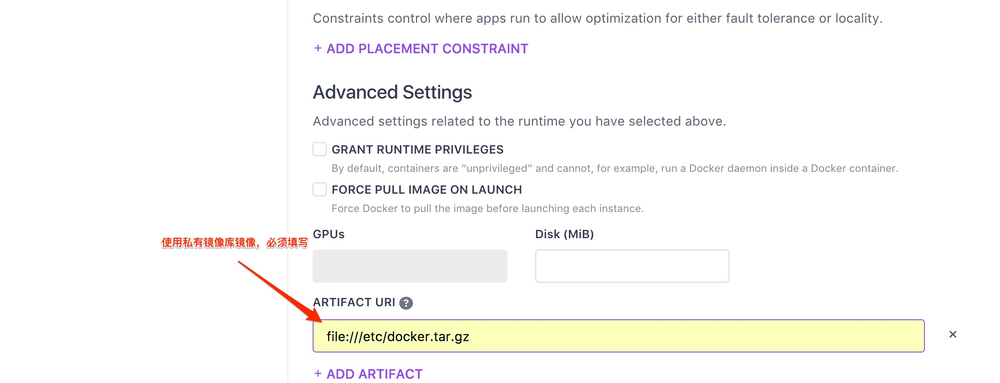

设置Networking，选择Virtual Network，配置主机端口映射，主机端口随机。

	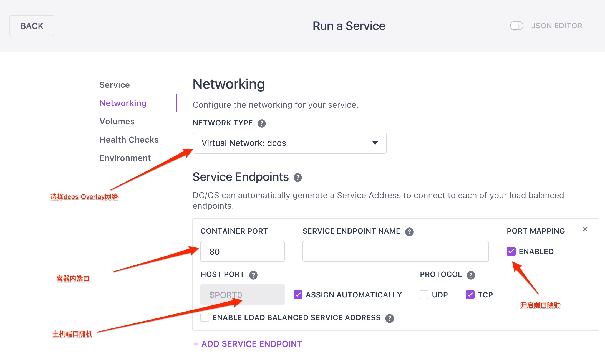

然后设置Volumes，创建50M大小、名字叫data的Persistent Volume，然后将data挂载到容器的/tmp目录。

	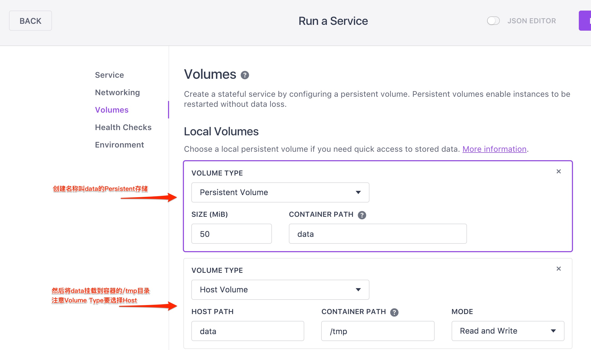

设置Health Check

	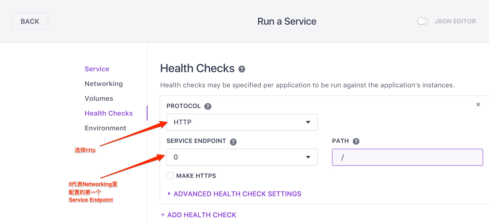

点击 REVIEW & RUN，应用就部署完了。

如何访问？
进入应用的信息页面,等待应用运行状态变为Running，

	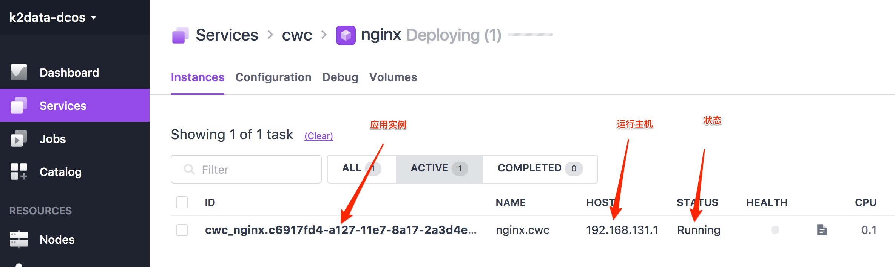

点击应用的instance示例，进入应用详情界面

	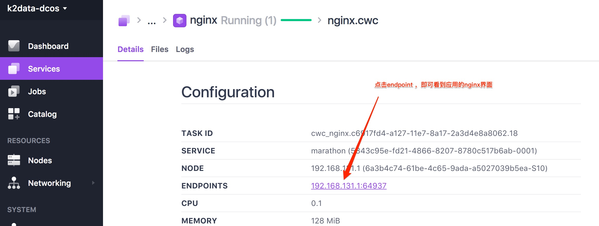

从服务市场启动一个服务
------
两种方式进入服务市场：
1. 在平台首页左侧导航栏点击Catalog
2. 在“Services”页面点击右上角+号，然后选择 Install a Package
然后你可以在服务市场浏览服务目录，也可以通过搜索条通过关键字搜索你想要的服务
选中服务后，点击右上角 Review & Run 就可以了

FAQ
======

* [Table of Contents](#qa)
   * [什么是ARTIFACT URI](#artifact)
   * [PaaS中网络模式Host、Bridge、Virtual Network的区别](#PaaS中网络模式的区别)
   * [PaaS中存储类型的区别](#PaaS中存储类型的区别)
   * [Host Volume使用](#HostVolume使用)
   * [PaaS中的应用命名](#PaaS中的应用命名)
   * [PaaS中的服务发现](#PaaS中的服务发现)
   * [PaaS中如何使用dev私有镜像库镜像](#PaaS中如何使用dev私有镜像库镜像)

注：
* node节点是指PaaS中真正运行容器的主机。
* 有状态应用是指有存储资源的应用。
* 无状态应用是指没存储资源，也没有指定运行node节点的应用。

什么是ARTIFACT URI
------

创建应用时在Service》MORESETTINGS下面有个ARTIFACT URI的配置项，这个地方填写的是文件的下载地址，文件会在容器启动之前下载到容器内部。
如果URI填写如下类型的压缩包.tar, .tar.gz, .tar.bz2, .tar.xz .gz, .tgz, .tbz2, .txz, .zip，压缩包下载之后默认会自动解压。

使用示例：
* 普通文件，在Service页面填写Artifact URI之后，然后在Volume页面直接挂载文件名。
* 压缩包文件，在Service页面填写Artifact URI之后，然后在Volume页面填写解压之后的目录名

Artifact URI配置

	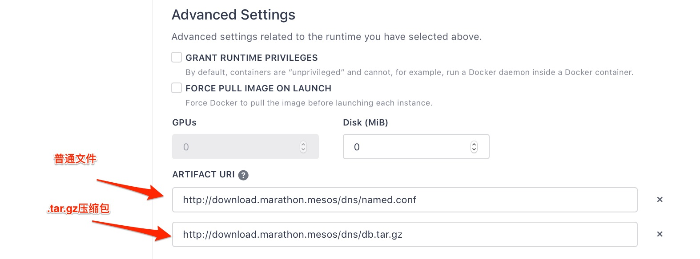

Volume使用配置

	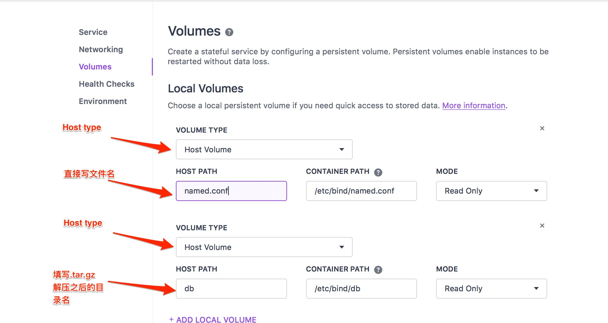

<!-- 然后这样使用，将这个文件挂载到容器的指定路径文件，比如hostpath=DCOS-Manuals.markdown containerpath=/path/to/dest/DCOS-Manuals.markdown -->

PaaS中网络模式Host、Bridge、Virtual Network的区别
------

| 模式 | 类似于docker网络中 | 跨node节点容器之间通信 | 跨node节点容器与任意节点之间通信 |
|:---:|:---:|:---:|:---:|
| Host | Host | 可以 | 可以 |
| Bridge | Bridge | 不可以 | 不可以 |
| Virtual Network | Overlay | 可以 | 可以 |

PaaS中存储类型的区别
------

| 模式 | 资源类型 | 删除应用 | 重启应用 | 使用方法 |
| --- | --- | --- | --- | --- |
| Host Volume | 本地路径 | 数据保留 | 数据保留 | 先在目标node节点上创建路径，然后运行容器时指定运行node节点。
| Persistent Volume | 存储资源池 | 数据销毁 | 数据保留 | 先在存储资源池中创建存储资源，然后将存储资源挂载到容器的指定路径。

* 有状态应用无论使用哪种存储模式，都是不可以自动迁移的。使用Persistent Volume时，PaaS会找一个满足资源需求的node节点创建存储资源，之后这个应用只运行在这个node节点。
* 只要应用不删除，存储的数据就不会销毁。
* 通过Host Volume挂载的目录文件，在PaaS应用界面的Files标签页不可见。

Host Volume使用
------

| Host Path（源）| Container Path（目标）| 效果 | 备注 |
| --- | --- | --- | --- |
| 已存在的文件 | 1.已存在的文件   2.已存在的目录   3.不存在 | 1.覆盖目标文件   2.报错，应用创建失败   3.创建所有中间目录（相当于 mkdir -p），然后映射文件 | 所以，映射文件 foo 到指定目录应该为：  hostpath=foo containerpath=/path/to/dest/foo   而不能为：  hostpath=foo containerpath=/path/to/dest/，即使 dest 目录已经存在 |
| 已存在的目录 | 1.已存在的文件   2.已存在的目录   3.不存在 | 1.报错，应用创建失败   2.覆盖目标目录    3.创建所有中间目录（相当于mkdir -p），然后 host path 内所有内容映射到 container path 上 | 所以，映射目录到目录没有什么坑，只需要注意 container path 不是一个已经存在的文件就好 |
| 不存在，会被系统默认为目录 |  1.已存在的文件   2.已存在的目录   3.不存在 | 1.报错，应用创建失败   2.自动创建 host path，然后映射目录   3.自动创建 host path，自动创建container path，然后映射目录 | - |

* Host路径写相对路径，一般配合artifact、Persistent Volume使用。
* Host路径写绝对路径，绝对路径指的是应用所在的node节点的本地路径。指定运行主机的应用可以使用。

PaaS中的应用命名
------

PaaS中的应用命名（Service ID）是由Group名+应用名组成的。
比如运维团队的工作区Group名是ops,创建了一个应用叫test,那这个应用在PaaS中的Service ID命名是/ops/test。
因为用户是看不到非本工作区应用的，所以在创建应用的时候，一定要看一看Service ID那一栏有没有自己工作区的前缀。

PaaS中的服务发现
------

PaaS中部署的应用都已经加入了内网dns解析，按域名命名规则访问就可以，比如应用/ops/test，命名规则示例：

* test.ops.marathon.mesos，dns解析到的是容器IP
* test.ops.marathon.slave.mesos，dns解析到的是容器所在的node节点IP

PaaS中如何使用dev私有镜像库镜像
------

在PaaS中，使用私有镜像库镜像，在部署应用时需要设置artifact,才能通过registry认证。设置地址在Service》MORESRTTINGS》ARTIFACT URI处填写 file:///etc/docker.tar.gz

[Hit Top](#qa)
